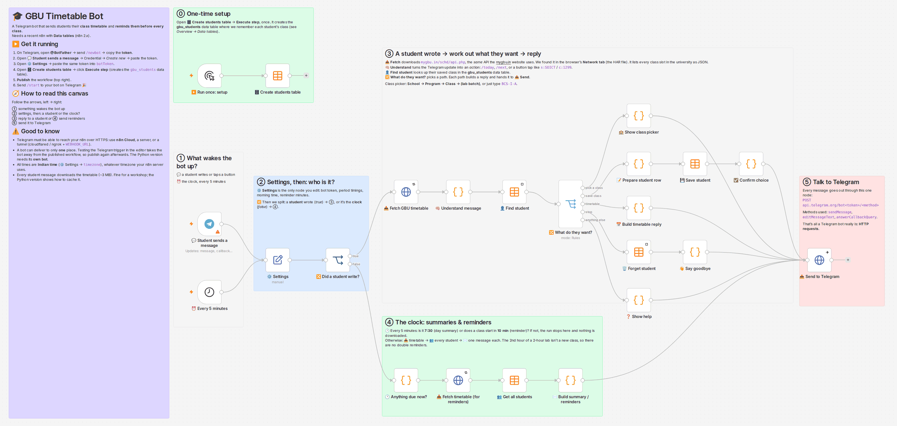
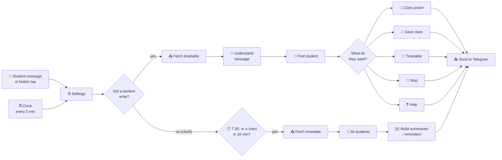

# 🎓 GBU Timetable Bot

A Telegram bot for Gautam Buddha University students. You pick your class once, and the bot:

- sends your **day's timetable at 7:30 AM**
- **reminds you 10 minutes before every class** (room, teacher, subject)
- answers **Today / Tomorrow / Next class / Week** whenever you ask

It is built twice, for a beginner workshop:

| | **n8n workflow** | **Python code** |
|---|---|---|
| Where | [`n8n/gbu-timetable-bot.json`](n8n/) | this folder (`bot.py` + 6 small files) |
| Best for | *seeing* how data flows, box by box | *understanding* how it really works |
| Needs | an n8n account/server | Python 3.9+ and one library (`requests`) |

Both versions give the same answers to the same messages. They were tested against each other.



---

## What a student sees

| Student does | Bot replies |
|---|---|
| `/start` | buttons: **School → Program → Class → Lab batch** |
| types `BCS-I-A` | finds the class; one tap to save it |
| 📅 Today / ➡️ Tomorrow | that day's classes with time, room and teacher |
| ⏭ Next class | what's on right now and what's next |
| 🗓 Week | Mon … Sun buttons, each shows that day |
| `/stop` | forgets them, no more messages |
| *(automatic, 7:30 AM)* | ☀️ "Good morning! Here's your day…" |
| *(automatic, 10 min before)* | 🔔 reminder for the class that's about to start |

```
🔔 Class in 10 minutes!

⏰ 15:30–17:30 · Lab
🧪 Problem Solving Using C Lab
CSE183 · 👤 Anurag Singh Baghel · 📍 IP107
```

Two-hour labs show up as one class (15:30–17:30), and there's only one reminder for them. If a class's labs are split into batches, students pick their batch and only see their own lab.

---

## How it works



That's the n8n canvas. The Python version has the same steps as functions (see the [map below](#n8n--python-map)).

---

## Where the timetable comes from

Nobody gave us an API. We found it ourselves:

1. Open <https://mygbu.in/db> in Chrome → **F12** → **Network** tab → filter **Fetch/XHR**.
2. Reload. The page downloads **one JSON file** with every class in the university.
3. (We saved that session as a `.har` file and read it to understand the data.)

| URL | Notes |
|---|---|
| `https://mygbu.in/schd/api.php` | live data, ~3 MB. Used by the *Free rooms / Free teachers* pages. **We use this.** |
| `https://samay.mygbu.in/api.php` | mirror used by *Browse timetables*. Compressed (~0.6 MB) but updated less often. **Backup.** |

No login is needed. Each item is one class slot:

```json
{ "TT_Day": "2", "TT_Period": "8", "Batch_Id": "1", "ActivityTag": "Lab",
  "Section_Id": "1", "SectionName": "BCS-I-A", "program_name": "B.Tech (CS)", "school": "SOICT",
  "Subject_Code": "CSE183", "subject_name": "Problem Solving Using C Lab",
  "TeacherName": "Anurag Singh Baghel", "RoomName": "IP107          " }
```

| Field | Meaning |
|---|---|
| `TT_Day` | 1 = Monday … 6 = Saturday, 7 = Sunday |
| `TT_Period` | 1–11. Times come from a table in `config.py` / ⚙️ Settings: period 1 = 08:30–09:30, then 1 hour each (the same rule the website's own JavaScript uses) |
| `Batch_Id` | 0 = whole class, 1 / 2 / 3 = lab batch |
| `Section_Id` | a stable id for the class. Names have stray spaces, ids don't |
| `school` → `program_name` → `SectionName` | the 3 levels of the class picker |

Messy bits the code handles: names padded with spaces, missing rooms or teachers, 2-hour labs stored as two separate periods, duplicate rows, and a response that sometimes starts with blank spaces.

---

## Run the Python version

```bash
pip install -r requirements.txt          # Windows: py -m pip install -r requirements.txt

python try_it.py BCS-I-A                  # see it work in the terminal, no Telegram needed
python try_it.py BCS-I-A tuesday 1        # Tuesday, lab batch 1
```

Then make it a real bot:

1. On Telegram, open **@BotFather**, send `/newbot`, and copy the token.
2. Copy `.env.example` to `.env` (`cp .env.example .env`, or `copy .env.example .env` on Windows) and paste the token in it.
3. Start it:

```bash
python bot.py
```

Now send `/start` to your bot. Stop it with **Ctrl + C**. Students and reminders are remembered in `data/`.

- **No internet to mygbu.in?** Put `TIMETABLE_URL=sample_data/timetable_sample.json` in `.env`. It holds every first-year B.Tech class (snapshot from 30 Sep 2026).
- **Tests:** `python -m unittest discover tests -v` (no internet or token needed).

## Run the n8n version

Short version: **import** `n8n/gbu-timetable-bot.json` → create the **Telegram credential** → paste the token in **⚙️ Settings** → run **🗄️ Create students table** once → **Publish**.
Step-by-step instructions and gotchas are in **[n8n/README.md](n8n/README.md)**.

---

## n8n ↔ Python map

| n8n node | Python |
|---|---|
| 💬 Student sends a message | `telegram_api.get_updates()` in the loop in `bot.py` |
| ⏰ Every 5 minutes | `reminders.tick()`, called by `bot.py` every few seconds |
| ⚙️ Settings | `config.py` |
| 📥 Fetch GBU timetable | `timetable.Timetable.refresh()` |
| 🧠 Understand message | `replies.understand()` |
| 👤 Find / 💾 Save / 🗑️ Forget student | `students.get()` / `save()` / `remove()` |
| 🔀 What do they want? | the `ACTIONS` table in `replies.py` |
| 🏫 Show class picker | `replies.show_schools()`, `show_programs()`, `show_sections()`, `search()` |
| 📝 Prepare row → 💾 Save → ✅ Confirm | `replies.save_class()`, `save_batch()`, `finish_setup()` |
| 📅 Build timetable reply | `replies.show_day()`, `show_next()`, `show_week()` + `messages.py` |
| 🕐 Anything due now? | the time checks in `reminders.tick()` |
| ✉️ Build summary / reminders | `reminders.send_morning_summaries()`, `send_class_reminders()` |
| 📤 Send to Telegram | `telegram_api.call()` |

The Python version does a few extra "real-world" things:

- It **caches** the timetable for 3 hours instead of downloading 3 MB for every message.
- If mygbu.in is down, it **falls back** to the mirror, then to the last saved copy.
- It stops messaging students who **blocked the bot**.

---

## Files

```
bot.py            start here: the main loop (poll Telegram, reply, check the clock)
config.py         settings: period timings, reminder time, where the data comes from
timetable.py      download + understand the mygbu.in data (join 2-hour labs, next class…)
students.py       remember each student's class in data/students.json
replies.py        the brain: what to do with each message or button tap
messages.py       every text and button the bot sends
reminders.py      the clock: 7:30 summary + reminders, never sends twice
telegram_api.py   the 4 Telegram API calls we need, using plain HTTP
try_it.py         play with the timetable logic in your terminal
tests/            unit tests (offline)
sample_data/      first-year B.Tech timetable snapshot, for offline use
n8n/              the n8n workflow + how to import it
```

---

## Teaching it (suggested 90 minutes)

1. **Demo (10 min).** Everyone messages the bot, picks their class, taps 📅 Today.
2. **Where does data come from? (15 min).** Open mygbu.in → DevTools → Network → `api.php`. Read one JSON row together.
3. **n8n walkthrough (25 min).** Follow ① → ⑤ on the canvas. Open **Executions**, click through a real run, and watch a message turn into an *action* and then into a reply. Open **Data tables → gbu_students**.
4. **Same thing in Python (25 min).** Run `try_it.py`. Use the map above to find each n8n node in the code. Run `bot.py`.
5. **Exercises (15 min).** Pick one below.

### Exercises

1. **Easy:** send reminders 15 minutes before class instead of 10.
2. **Easy:** change the ☕ free-period line, or add a 🍱 lunch message.
3. **Medium:** add `/free`, which lists today's free periods.
4. **Medium:** add `/room IL-104`, which shows who is in that room right now (like the website's *Free rooms* page).
5. **Medium:** send a 9 PM "tomorrow's classes" preview.
6. **Harder (n8n):** remove students who blocked the bot. Hint: look at 📤 Send's output for error 403.
7. **Harder (n8n):** stop downloading 3 MB per message. Cache the timetable, like the Python version does.

---

## Troubleshooting

| Problem | Fix |
|---|---|
| `python bot.py` says *No bot token found* | create `.env` from `.env.example` and paste the token |
| *Telegram didn't accept the token* | copy it again from @BotFather: no spaces, no quotes |
| The Python bot and n8n fight over messages | one bot can deliver to only one program. Make a second bot in @BotFather |
| *Conflict: terminated by other getUpdates request* | `bot.py` is running twice. Close the other terminal |
| n8n bot doesn't reply | see [n8n/README.md → troubleshooting](n8n/README.md#troubleshooting) |
| mygbu.in is slow or down | Python uses the mirror or its saved copy; or set `TIMETABLE_URL=sample_data/timetable_sample.json` |
| Emojis look broken in the Windows terminal | use Windows Terminal, or run `chcp 65001` first |

## Notes for the organiser

- **Check the period timings** against the real bell schedule. They follow the mygbu.in website's rule (08:30 start, 1 hour each). Change them in `config.py → PERIODS` and in ⚙️ Settings → `periods`.
- **Server load:** each n8n chat message downloads `schd/api.php` (~3 MB, uncompressed). Turning on gzip for that URL on the server would make it about 4–5× smaller; the `samay` mirror already uses Brotli.
- **Use two bots**: one for the n8n demo and one for the Python demo.
- The data is public (the website loads it without login), but be kind to the server: the Python version downloads it at most once every 3 hours.
